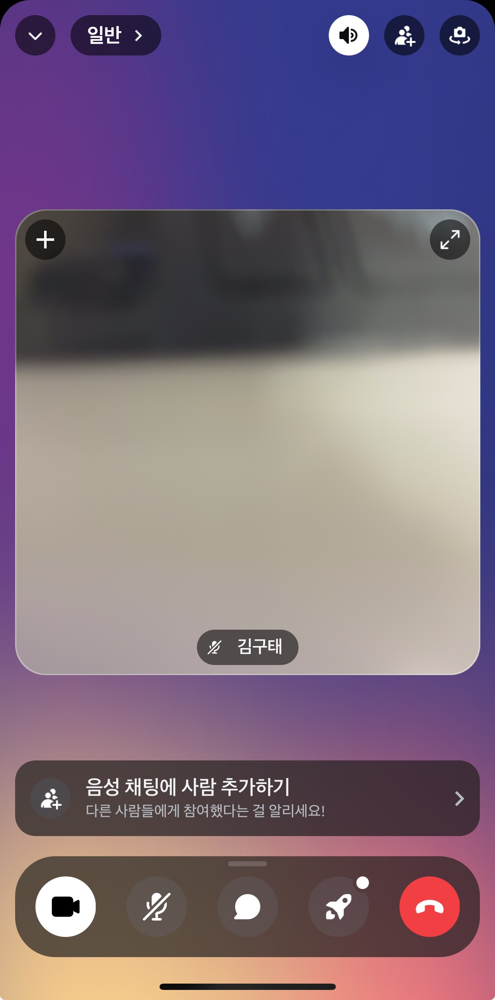
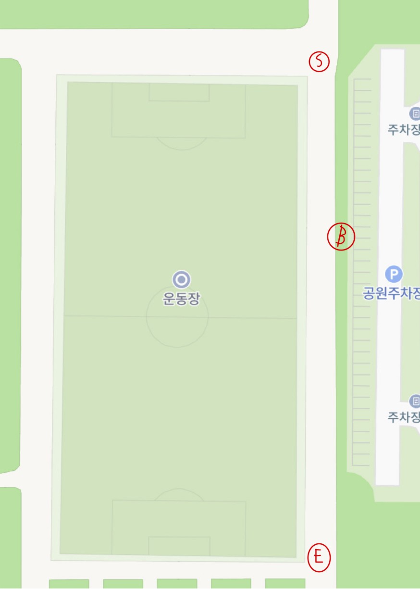

# 시연 시나리오

# 시연 날짜 : 8 / 16 (금)

# 강의실 시연

## 박재현

### 데스크탑 모드 (ctrl + win + 좌, 우 방향키)

1. UCC
2. PPT
3. 웹 Discord(박재현 id) + 윤지호 폰
4. Discord (어플) + 최민 + 이형준 + OBS

- F1 : 이형준 + 최민 휴대폰 화면
- F2 : 최민 휴대폰 화면
- F3 :  이형준 + 녹화 화면

### 강의실 내 윤지호 휴대폰 시연

- 어플을 들어간다
- 테스트 계정으로 로그인 한다
    - id : test@ssafy.com
    - 비밀번호 : 00000000 (0 x 8개)
- 로그인 후 화면에서 날씨 정보 보여준다
- 커뮤니티 페이지로 이동
    - 테스트 계정의 지역 정보는 부산광역시 진구
- 회원 정보 수정에서 부산광역시 강서구로 정보 수정
- 작성된 글 보여다
    - 아래에 있는 글 클릭
    - 댓글 보여준다
- 글 쓰기 클릭
    - 글 작성하는 방법을 보여준다
- 리포트 페이지 이동
- 리포트 클릭
    - 저장된 데이터를 보여준다
- 끝

# 라이브 시연 러너 팀

## 역할

- 구현우 (재현이랑 전화 연결)
    - 사용 계정
        - 아이디 : 123456@naver.com
        - 비밀번호 : 00000000
        
        ---
        
- 박지원
    - 사용 계정
        - 아이디 : gootae0220@naver.com
        - 비밀번호 : 00000000
        
        ---
        
- 최민 (PWA)
    - 사용 계정
        - 아이디 : min@naver.com
        - 비밀번호 : 00000000

---

---

---

## 카메라 맨

- 이형준

# 스케줄

- 09 : 05 :: 이정원 프로님과 함께 라이브 시연 팀 > 희망공원
- 09 : 15 :: 공원 도착 후 최민, 이형준 디스코드 **일반 방** 입장

- 최민 : 마이크 음소거, 화면 공유하기 (화면 공유하기는 터치 안하거나 hold 버튼 누르면 나가지는 경우가 있으니 수시로 체크 필요)
- 형준이형 : 마이크 음소거, (후면)카메라 on (꺼지는 경우도 있으니 수시로 체크 필요, 아래 화면처럼 나오면 Okay.)

- 09 : 20 :: 최민 지도 하에 라이브 시연 리허설
- 09 : 45 :: 발표 시작 후 박재현 > 구현우한테 전화(전화 계속 듣고 있어야 한다.)
- 09 : 52 :: 약 발표 7분 후, PPT에서 기능 관련 설명 후 “라이브 시연으로 넘어가겠습니다~” >>시연  (이때까지 대기, 삼성전기 안에서 윤지호 휴대폰으로 라이브 시연)
- 09 : 55 or 57 : 러닝 시작!

# 라이브 시연 조 시나리오

- S : 출발 지점
- B : 벤치
- E : 종료 지점

- 측정 시작
    - S ~ B :
        - 박지원, 최민 :
            - 먼저 천천히 뛰어 간다. (이 때 구현우는 출발 선에 있는다. 30 m 가 넘어설 때까지 기다린다.  삐용? 소리 날 때까지)
            - 삐용? 소리나면 정지한다. (구현우가 올 때까지 대기)
        
        - 이형준
            - 이때는 박지원 , 최민을 찍으면서 뛴다.
        
        - 구현우 :
            - 이형준이 삐용 소리를 듣고 왼손을 들어서 오라고 하면 천천히 뛰어서 박지원, 최최민이랑 만난다.
    
    - B ~ E : 다같이 모여서 천천히 뛰면서 3개의 점이 모여서 이동 하는 것을 보여준다.
    
    - E :
        - 최민
            - 도착 후 최민은 종료 버튼을 누르고 리포트에서 저장된 것을 보여준다.
            - 라이브 시연 종료